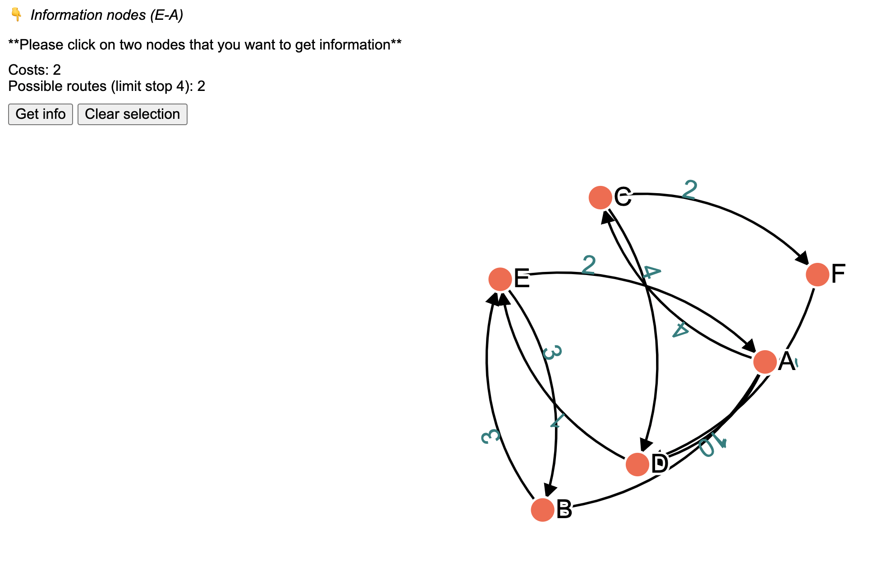
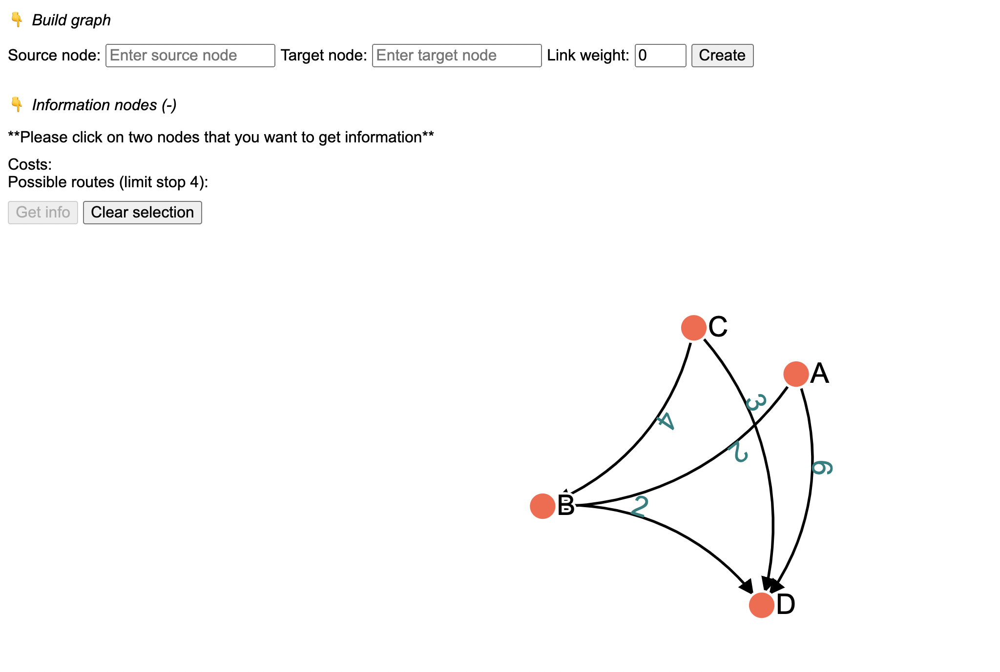

## How to run this project

1. Clone this repository to your local macine.
2. `cd delivery-service`
3. `yarn`
4. `yarn dev`

## Tools & Technologies

1. **Vite** - for initialize React project with typescript and React fast-refresh.
2. **React** - creating UI and manage application state.
3. **D3** - rendering graph for visualization.
4. **Jest** - for testing.

## How to use this application

I've designed the application to use in two modes.

1. Development mode: Using the givend data `AB1, AC4, AD10, BE3, CD4, CF2, DE1, EB3, EA2, FD1` to create the graph. This mode is not allowed user to create a graph.

2. Normal mode: Allow user to create a graph. You can enable this by adjusting `DEVELOPMENT` variable from `1` to `0` on `App.tsx` file. In this mode, you will see `👉 Build graph` element that you can expand it. Once you have expanded it you will be able to insert your graph data one by one by yourself.

The application also have another element on the screen which is `👉 Information nodes (x - x)` that you can expand it. Once you've expanded it, you would see `Get info` button that you can click to get the information of two nodes that you're interested. However, you need to select two nodes on the graph first. After you click `Get info` it will execute the function that use for fulfill unit tests.

## Testing

There's only one test file which is `utils.test.ts` which is mean to solve all the given quesion **EXCEPT** the bonus one.
